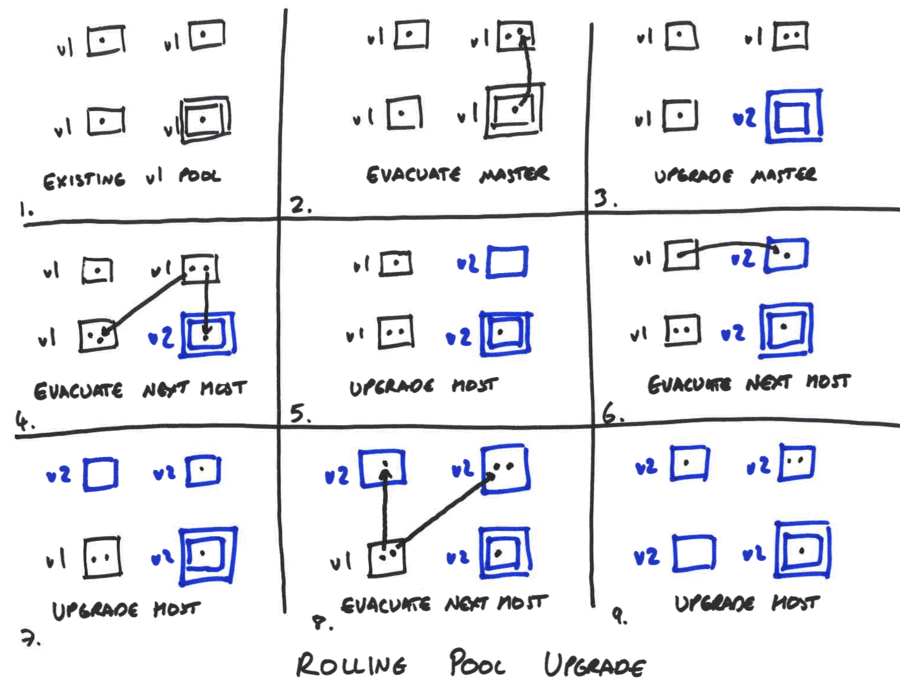

Rolling pool upgrade allows the host software to be upgraded without incurring
downtime. An upgrade is a sequence of operations:
- *evacuating* a host: this automatically migrates all VMs to other suitable
  hosts and leaves the host in maintenance mode
- *upgrading* a host: this is a manual step (which could be automated via e.g.
  PXE) by which the software is updated

The following diagram shows an upgrade of a 4 host pool:

The xapi master host must be upgraded first. A new xapi version can always
talk to an old xapi, but an old xapi may not be able to talk to a a new one.
Once the master is upgraded the rest of the hosts may be upgraded in any
order. When the upgrade is complete all VMs should still be running (provided
  there was enough spare capacity during the procedure) but may now be running
on different hosts.
