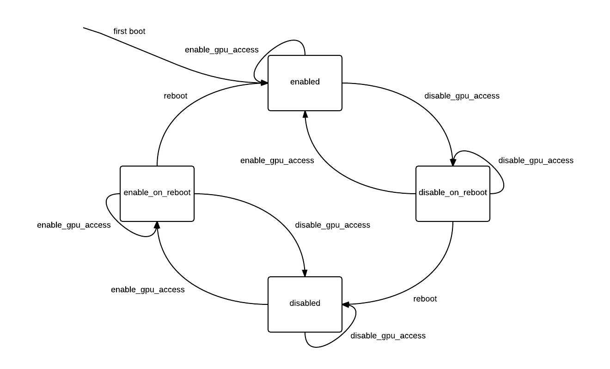

Introduction
------------

Passthrough of discrete GPUs has been
[available since XenServer 6.0]({{site.baseurl}}/xapi/design/gpu-passthrough.html).
With some extensions, we will also be able to support passthrough of integrated
GPUs.

- Whether an integrated GPU will be accessible to dom0 or available to
  passthrough to guests must be configurable via XenAPI.
- Passthrough of an integrated GPU requires an extra flag to be sent to qemu.

Host Configuration
------------------

New fields will be added:

- `host.display enum(enabled|disable_on_reboot|disabled|enable_on_reboot)`
- `PGPU.dom0_access enum(enabled|disable_on_reboot|disabled|enable_on_reboot)`

as well as new API calls:

- `host.enable_GPU_access`
- `host.disable_GPU_access`

Calling `host.disable_GPU_access` will modify the host boot config (using the
xen-cmdline tool) such that after the next boot dom0 will not be able to access
any integrated GPUs, and neither xen nor dom0 will attempt to use the the VGA
graphics adapter on next boot.

A state diagram for the fields PGPU.dom0_access and host.display is shown below:

Although the two fields will be modified in unison, they represent different
settings and we may wish to modify them independently in the future.

Note that when a client enables or disables host GPU access, the change can be
cancelled until the host is rebooted.

Handling vga_arbiter
--------------------

Currently, xapi will not create a PGPU object for the PCI device with address
reported by `/dev/vga_arbiter`. This is to prevent a GPU in use by dom0 from
from being passed through to a guest. This behaviour will be changed - instead
of not creating a PGPU object at all, xapi will create a PGPU, but its
supported_VGPU_types field will be empty.

However, the PGPU's supported_VGPU_types will be populated as normal if:

1.  dom0 access to the GPU is disabled.
2.  The vendor ID of the device is contained in a whitelist provided by xapi's
    config file.

Interfacing with xenopsd
------------------------

When starting a VM attached to an integrated GPU, the VM config sent to xenopsd
will contain a video_card of type IGD_passthrough. This will override the type
determined from VM.platform:vga. xapi will consider a GPU to be integrated if
both:

1.  It resides on bus 0.
2.  The vendor ID of the device is contained in a whitelist provided by xapi's
    config file.

When xenopsd starts qemu for a VM with a video_card of type IGD_passthrough,
it will pass the flags "-std-vga" AND "-gfx_passthru".
