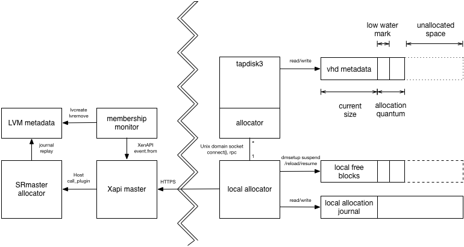

LVHD is a block-based storage system built on top of Xapi and LVM. LVHD
disks are represented as LVM LVs with vhd-format data inside. When a
disk is snapshotted, the LVM LV is "deflated" to the minimum-possible
size, just big enough to store the current vhd data. All other disks are
stored "inflated" i.e. consuming the maximum amount of storage space.
This proposal describes how we could add dynamic thin-provisioning to
LVHD such that

- disks only consume the space they need (plus an adjustable small
  overhead)
- when a disk needs more space, the allocation can be done *locally*
  in the common-case; in particular there is no network RPC in the
  common-case
- when the resource pool master host has failed, allocations can still
  continue, up to some limit, allowing time for the master host to be
  recovered; in particular there is no need for very low HA timeouts.
- we can (in future) support in-kernel block allocation through the
  device mapper dm-thin target.



All VM disk writes are channeled through ```tapdisk3``` which keeps
track of how much space remains reserved in the LVM LV. When the
free space drops below a "low-water mark" (configurable via a host
config file), ```tapdisk3``` opens a connection to a `local-allocator`
process and requests more space asynchronously. If ```tapdisk3```
notices the free space approach zero then it should start to slow
I/O in order to provide the local allocator more time.
Eventually if ```tapdisk3``` runs
out of space before the local allocator can satisfy the request then
guest I/O will block. Note Windows VMs will start to crash if guest
I/O blocks for more than 70s.

Every host has a `local-allocator` daemon which manages a host-wide
pool of blocks (represented by an LVM LV) and provides them to ```tapdisk3```
on demand. When it receives a request, the local allocator decides
which blocks to provide from its local free pool, writes to the journal,
writes the update to an outgoing `toLVM` queue and then reloads the device mapper
table to extend the LV. When a VDI is deactivated, the current items on the
`toLVM` queue are flushed synchonously.

As well as waiting for requests from `tapdisk3`, the `local-allocator` also
watches for new block allocations from the `SRmaster-allocator` via the
`fromLVM` queue. These allocations are used to resize the local host free
block LV locally via device mapper.

Interaction with HA
===================

Consider what will happen if a host fails when HA is disabled:

- if the host is a slave: the VMs running on the host will crash but
  no other host is affected.
- if the host is a master: allocation requests from running VMs will
  continue provided enough free blocks are cached on the hosts. If a
  host eventually runs out of free blocks, then guest I/O will start to
  block and VMs may eventually crash.

Therefore we *recommend* that users enable HA and only disable it
for short periods of time. Note that, unlike other thin-provisioning
implementations, we will allow HA to be disabled.

Host-local LVs
==============

When a host calls SMAPI ```sr_attach```, it will attach three LVM volumes:

- ```host-<uuid>-free```: these are free blocks cached on the host.
- ```host-<uuid>-toLVM```: these are metadata changes made locally which need
  to be replayed against the LVM metadata by the SRmaster
  ```host-<uuid>-fromLVM```: these are metadata changes made by the SRmaster
  to extend the ```host-<uuid>-free``` which should be replayed against
  local device mapper.

The ```sr_attach``` will also ensure a "local journal" exists (a local sparse
  file big enough to contain at least one operation + overheads). When
the `local-allocator` starts up it will first replay any pending operations found
in the local journal before inspecting the other volumes.

For ease of debugging and troubleshooting, we should create command-line
tools to dump and replay the journal.

Monitoring
==========

The local allocator process should export RRD datasources over shared
memory named

- ```sr_<SR uuid>_<host uuid>_free```: the number of free blocks in
  the local cache. It's useful to look at this and verify that it doesn't
  usually hit zero, since that's when allocations will start to block.
  For this reason we should use the `MIN` consolidation function.
- ```sr_<SR uuid>_<host uuid>_requests```: a counter of the number
  of satisfied allocation requests. If this number is too high then the quantum
  of allocation should be increased. For this reason we should use the
  `MAX` consolidation function.
- ```sr_<SR uuid>_<host uuid>_allocations```: a counter of the number of
  bytes being allocated. If the allocation rate is too high compared with
  the number of free blocks divided by the HA timeout period then the
  `SRmaster-allocator` should be reconfigured to supply more blocks with the host.

Modifications to tapdisk3
=========================

```tapdisk3``` will be modified to

- on open: discover the current maximum size of the file/LV (for a file
  we assume there is no limit for now)
- read a low-water mark value from a config file ```/etc/tapdisk3.conf```
- read a very-low-water mark value from a config file ```/etc/tapdisk3.conf```
- read a Unix domain socket path from a config file ```/etc/tapdisk3.conf```
- when there is less free space available than the low-water mark: connect
  to Unix domain socket and write an "extend" request
- upon receiving the "extend" response, re-read the maximum size of the
  file/LV
- when there is less free space available than the very-low-water mark:
  start to slow I/O responses and write a single 'error' line to the log.

The extend request
------------------

The request has the following format:

Octet offsets | Name     | Description
--------------|----------|------------
0,1           | tl       | Total length (including this field) of message (in network byte order)
2             | type     | The value '0' indicating an extend request
3             | nl       | The length of the LV name in octets, including NULL terminator
4,...,4+nl-1  | name     | The LV name
4+nl-12+nl-1  | vdi_size | The virtual size of the logical VDI (in network byte order)
12+nl-20+nl-1 | lv_size  | The current size of the LV (in network byte order)
20+nl-28+nl-1 | cur_size | The current size of the vhd metadata (in network byte order)

The extend response
-------------------

The response is a single byte value "0" which is a signal to re-examime
the LV size. The request will block indefinitely until it succeeds. The
request will block for a long time if

- the SR has genuinely run out of space. The admin should observe the
  existing free space graphs/alerts and perform an SR resize.
- the master has failed and HA is disabled. The admin should re-enable
  HA or fix the problem manually.

The local-allocator
===================

There is one `local-allocator` process per attached SR. The process will be
spawned by the SM ```sr_attach``` call, and sent a shutdown message from
the ```sr_detach``` call.

The `local-allocator` accepts command-line arguments:

```
thin-lvhd-local-allocator     \
  --config <path>             \
  --socket <path>             \
  --journal <path>            \
  --freePool <path>           \
  --fromLVM <path>            \
  --toLVM <path>
```
where

- `--config` names the config file
- `--socket` names the Unix domain socket used for receiving allocation requests
from `tapdisk3`
- `--journal` names the host local journal which is used to cope with daemon crashes
- `--freePool` names the device-mapper device containing the blocks free for
local allocation
- `--fromLVM` names the device containing new free block allocations from
the host which controls the LVM metadata
- `--toLVM` names the device containing the local allocations which should be
replayed against the LVM metadata

The `local-allocator` also reads a config file containing:

```
# global section

# amount to provide to an LV when requested
vdi-allocation-quantum=100M
```

When the `local-allocator` process starts up it will read the host local
journal and

- re-execute any pending allocation requests from tapdisk
- compute the lowest still-free block in the local free block device for
future allocations

The procedure for handling an allocation request from tapdisk is:

1. if there aren't enough free blocks in the free pool, wait polling the
   `fromLVM` queue
2. choose a range of blocks to assign to the tapdisk LV from the free LV
3. write the operation (i.e. exactly what we are about to do) to the journal.
   This ensures that it will be repeated if the allocator crashes and restarts.
   Note that, since the operation may be repeated multiple times, it must be
   idempotent.
5. push the block assignment to the `toLVM` queue
6. suspend the device mapper device
7. add/modify the device mapper target
8. resume the device mapper device
9. remove the operation from the local journal (i.e. there's no need to repeat
   it now)
10. reply to tapdisk

The shutdown request
--------------------

The shutdown request has the following format:

Octet offsets | Name     | Description
--------------|----------|------------
0,1           | tl       | Total length (including this field) of message (in network byte order)
2             | type     | The value '1' indicating a shutdown request

There is no response to the shutdown request. The `local-allocator` will
terminate as soon as it is able.

The SRmaster-allocator
======================

The `SRmaster-allocator` is a daemon run on the SRmaster node, started in
`sr_attach` and shutdown in `sr_detach`.

The `SRmaster-allocator` accepts command-line arguments:

```
SRmaster-allocator          \
--config <path>             \
--journal <path>
```
where

- `--config` names the config file
- `--journal` names the host local journal which is used to cope with daemon crashes

The config file contains the paths for all the control volumes and global
configuration,
for example

```
# global section
host-allocation-quantum=1G

[host1]
to-LVM=<path>
from-LVM=<path>

[host2]
to-LVM=<path>
from-LVM=<path>
```

The `SRmaster-allocator` continually

- peeks at updates from all the `to-LVM` queues
- calculates how much free space each host still has
- if the free space for a host drops below some threshold:
  - choose some free blocks
- writes the change it is going to make to the local journal
- pops the updates from the `to-LVM` queues
- pushes the updates to the `from-LVM` queues
- rewrites the LVM metadata
- removes the change from the local journal

The membership monitor
======================

The role of the membership monitor is to

- destroy a host's local LVs when it has left the pool and the `toLVM` queue
  has been flushed
- rewrite the `SRmaster-allocator` config file when hosts have joined or left
  the pool

We shall

- install a ```host-pre-declare-dead``` script to wait for the `SRmaster-allocator`
  to flush the `toLVM` queue (i.e. when `peek` returns 0 elements) and delete
  the LV
- modify XenAPI ```Host.declare_dead``` to call ```host-pre-declare-dead``` before
  the VMs are unlocked
- add a ```host-pre-forget``` hook type which will be called just before a Host
  is forgotten
- install a ```host-pre-forget``` script to destroy the host's local LVs

Modifications to LVHD SR
========================

- `sr_attach` should:
  - if an SRmaster, update the `MGT` major version number to prevent
  - if an SRmaster, spawn `SRmaster-allocator`
  - if the `toLVM`, `fromLVM`, free block LVs don't exist then create them
  - spawn `local-allocator`
- `sr_detach` should:
  - shut down the `local-allocator`
  - if an SRmaster, shut down the `SRmaster-allocator`
- `vdi_deactivate` should:
  - run a plugin on the SRmaster to wait for all already-generated LVM updates
    to be flushed to the LVM metadata
- `vdi_activate` should:
  - if necessary, run a plugin on the SRmaster to deflate the LV to the new
    minimum size (+ some slack), 

Note that it is possible to attach and detach the individual hosts in any order
but when the SRmaster is unplugged then there will be no "refilling" of the host
local free LVs; it will behave as if the master host has failed.

Enabling thin provisioning
==========================

Thin provisioning will be automatically enabled on upgrade. When the SRmaster
plugs in `PBD` the `MGT` major version number will be bumped to prevent old
hosts from plugging in the SR and getting confused. When any host plugs in a
`PBD` it will create the necessary metadata volumes.
When a VDI is activated, it will be deflated to the new low size.

Disabling thin provisioning
===========================

We shall make a tool which will

- allow someone to downgrade their pool after enabling thin provisioning
- allow developers to test the upgrade logic without fully downgrading their
  hosts

The tool will

- check if there is enough space to fully inflate all non-snapshot leaves
- unplug all the non-SRmaster `PBD`s
- unplug the SRmaster `PBD`. As a side-effect all pending LVM updates will be
  written to the LVM metadata.
- modify the `MGT` volume to have the lower metadata version
- fully inflate all non-snapshot leaves

Walk-through: upgrade
=====================

Rolling upgrade should work in the usual way. As soon as the pool master has been
upgraded, hosts will be able to use thin provisioning when new VDIs are attached.
A VM suspend/resume/reboot or migrate will be needed to turn on thin provisioning
for existing running VMs.

Walk-through: downgrade
=======================

A pool may be safely downgraded to a previous version without thin provisioning
provided that the downgrade tool is run. If the tool hasn't run then the old
pool will refuse to attach the SR because the metadata has been upgraded.

Walk-through: after a host failure
==================================

If HA is enabled:

- ```xhad``` elects a new master if necessary
- the ```xhad``` tells ```Xapi``` which hosts are alive and which have failed.
- ```Xapi``` runs the ```host-pre-declare-dead``` scripts for every failed host
- the ```host-pre-declare-dead``` wait for the `toLVM` operations to be replayed
  against the LVM metadata on the SRmaster
- ```Xapi``` unlocks the VMs and restarts them on new hosts.

If HA is not enabled:

- the admin must tell ```Xapi``` which hosts have failed with ```xe host-declare-dead```
- ```Xapi``` runs the ```host-pre-declare-dead``` scripts for every failed host
- the ```host-pre-declare-dead``` wait for the `toLVM` operations to be replayed
against the LVM metadata on the SRmaster
- ```Xapi``` unlocks the VMs
- the admin may now restart the VMs on new hosts.

Future use of dm-thin?
======================

Dm-thin also uses 2 local LVs: one for the "thin pool" and one for the metadata.
After replaying our journal we could potentially delete our host local LVs and
switch over to dm-thin.

Summary of the impact on the admin
==================================

- If the VM workload performs a lot of disk allocation, then the admin *should*
  enable HA.
- The admin *must* not downgrade the pool without first cleanly detaching the
  storage.
- Extra metadata is needed to track thin provisioing, reducing the amount of
  space available for user volumes.
- If an SR is completely full then it will not be possible to enable thin
  provisioning.
